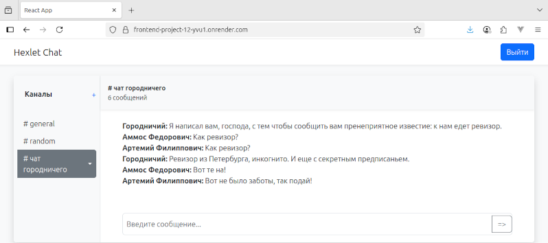

### Проект "Hexlet Chat"
Очень упрощенный аналог Slack-чата, фронтенд которого построен на технологии React.
Особенности: 
- авторизация
- регистрация новых пользователей
- переключение по каналам
- управление каналами (добавление, переименование, удаление)
- всплывающие уведомления (react-toastify)
- фильтрация запрещенных слов (leo-profanity).

Сообщения отправляются на сервер через POST запрос, получение данных от сервера происходит через websockets.

React приложение построено с помощью Vite.

#### Ссылка на проект
https://frontend-project-12-yvu1.onrender.com/

#### Используемые технологии
- React, React Router, Redux Toolkit, React Bootstrap
- Formik, Yup, i18next
- Socket.io client
- Bootstrap

### Системные требования
 - Node.js 20+ & npm 10+

### Установка и запуск

Скопируйте репозиторий:
```bash
git clone https://github.com/Chuvikovsky/frontend-project-12.git
```

Перейдите в папку frontend-project-12
```bash
cd frontend-project-12
```

Установите зависимости
```bash
make install
```

Собирите приложение
```bash
make build
```

Запустите сервер
```bash
make start
```



